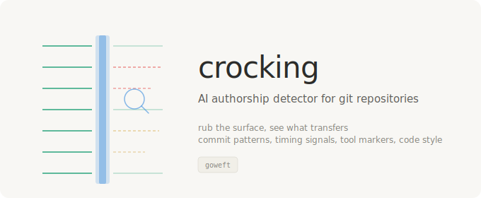

<p align="center"></p>

# Crocking

AI authorship detector for git repositories. Analyzes commit history for statistical signatures of undisclosed AI-generated code.

AI-generated code is entering codebases at an accelerating rate. Much of it arrives with proper attribution. Some doesn't. Crocking examines git history for the signals that AI authorship leaves behind — tool markers, commit message patterns, timing anomalies, diff structure, and code style uniformity — so teams can make informed decisions about compliance, licensing, and trust.

## Why This Exists

The Claude Code source leak revealed `undercover.ts` — a mode that strips AI attribution from commits when contributing to open-source repositories. That's one tool at one company. The broader pattern is everywhere: AI coding assistants generating commits that look human-authored.

This matters for licensing compliance (some licenses restrict AI-generated content), intellectual property audits, open-source contribution policies, and supply chain trust. Not to block AI use — to detect when it's undisclosed.

No standalone tool existed to scan git history for AI authorship signals. Crocking fills that gap.

## Quick Start

```bash
pip install crocking
crocking scan /path/to/repo
crocking scan . --format json
crocking check abc123def
crocking scan . --max-commits 500
```

## What It Detects

### Known AI Markers (AUTH-001)

| Pattern | Confidence |
|---------|-----------|
| Co-authored-by trailers (Copilot, Claude, Cursor, GPT, Codex) | DEFINITIVE |
| Generated-by trailers referencing AI tools | DEFINITIVE |
| Explicit AI-generation attribution markers | DEFINITIVE |
| GitHub Copilot suggestion commits | DEFINITIVE |

### Commit Message Patterns (AUTH-002)

| Pattern | Confidence |
|---------|-----------|
| Suspiciously uniform conventional commit formatting | MEDIUM |
| Repetitive commit message prefixes/templates | MEDIUM |
| Precisely-scoped conventional commits (characteristic length) | LOW |
| Structured bullet-point commit bodies | MEDIUM |

### Timing Signals (AUTH-003)

| Pattern | Confidence |
|---------|-----------|
| Burst commits (3+ in under 5 minutes) | MEDIUM |
| Uniform commit intervals (low coefficient of variation) | LOW |

### Diff Structure (AUTH-004)

| Pattern | Confidence |
|---------|-----------|
| Bulk file creation (5+ new files, 1000+ lines) | HIGH |
| Bulk file creation (3+ new files, 500+ lines) | MEDIUM |
| Pure addition commits (high insertion/deletion ratio) | MEDIUM |

### Code Style (AUTH-005)

| Pattern | Confidence |
|---------|-----------|
| AI generation comments in code | HIGH |
| Unusually high comment density (>35% of added lines) | LOW |

### File/Directory Markers

`.claude/`, `CLAUDE.md`, `.cursor/`, `.codex/`, `AGENTS.md`, `.github/copilot/`, `.aider/`, `.codeium/`, `.continue/`, `.v0/`, `.bolt/`, `.lovable/`

## Per-Author Scoring

| Score | Label | Meaning |
|-------|-------|---------|
| 70-100 | LIKELY AI | Strong signals of AI-assisted authorship |
| 40-69 | POSSIBLE AI | Multiple suggestive patterns |
| 15-39 | SOME SIGNALS | Weak indicators, could be human |
| 0-14 | LOW | No significant AI signals |

Weights: DEFINITIVE (1.0), HIGH (0.7), MEDIUM (0.4), LOW (0.15). The tool surfaces signals. Humans make the judgment call.

## Zero Dependencies

`crocking` uses only Python standard library modules plus the `git` CLI. No ML models, no API calls, no telemetry.

## Also by goweft

| When | Tool | What |
|------|------|------|
| Before publish | [**tenter**](https://github.com/goweft/tenter) | Pre-publish artifact integrity scanner |
| After fork | [**unshear**](https://github.com/goweft/unshear) | AI agent fork divergence detector |
| At runtime | [**heddle**](https://github.com/goweft/heddle) | Policy-and-trust layer for MCP tool servers |
| Across sessions | [**ratine**](https://github.com/goweft/ratine) | Agent memory poisoning detector |
| In git history | **crocking** | AI authorship detector (this tool) |

## License

MIT - see [LICENSE](LICENSE).
